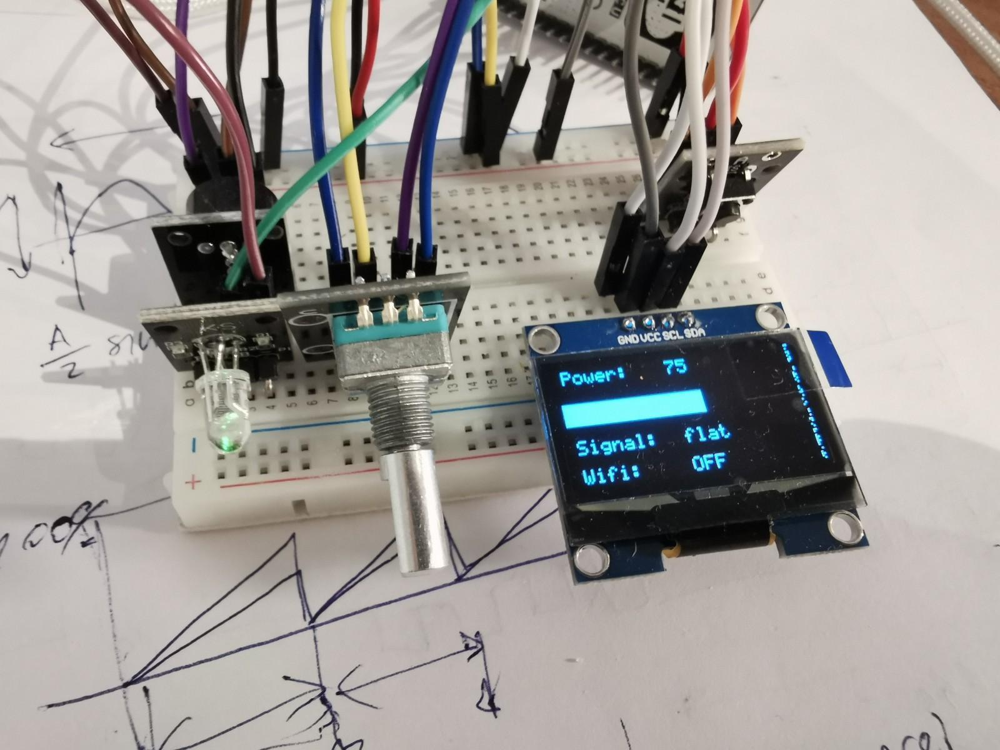

# Changing vibration pattern over WiFi

## Info

The schematic uses an ESP8266 Node MCU microcontroller that has an integrated WiFimodule ESP-12E module.

Microcontroller ESP8266 NodeMCU is a Chinese implementation of an Arduino microcontroller, which allows for easy integration with WiFi.
The ESP-12E module uses Tensilica Xtensa® 32-bit LX106 RISC microprocessor. 

It also has 128 KB RAM and 4MB flash memory.

ESP8266 uses the programming language Lua. However, in the scope of this project, I use the already written library, designed for use in the Arduino environment. It can be easily added with #include <ESP8266WiFi.h>.

## Components used:
 - LED light
 - NodeMCU
 - OLED display - 1.3" OLED IIC LCD- 64x128 (it displays a what is duty cycle, what kind is the signal and if the WiFi is connected)
- Rotary encoder (changes the duty cycle)
 - Button (changes different pattern signals - const, sine, square, saw wave)

## Wiring / Schematic
For the real application, I would need a DC motor with a weight eccentric to the shaft of the motor. And you would also need a MOSFET, that would switch the motor ON and OFF.
The signal that you that would use to regulate a DC is being simulated with a LED, which allows for a better visual representation.

This is how the wiring looks like. For the presentation, I used the application Fritzing.


## Code
Sedaj pojdimo na kodo. Ta je sestavljena iz 5 datotek, ki so kot rečene napisane v programskem okolju Arduino. Koda bo zapisana v pisavi Courier New, dodatni komentarji poleg obstoječih, ki sem jih napisala v angleščini pa so zapisani v pisavi Arial.


### MAIN DATOTEKA:

Definicije pinov:
```
#define BUZZER D7
#define BUTTON D6
#define RotaryPinA D3  // Used for generating interrupts using CLK signal
#define RotaryPinB D5
```
Uporabila sem že zapisano knjižnjici OLED https://github.com/durydevelop/arduino-lib-oled/, ki sem jo dobila na tem Github repozitoriju. To knjižnjico sem uporabila, ker je bila večina knjižnjic napisana za driver SSD1306 od OLED zaslona. Moj driver je SH1106, ki se malenkost razlikuje od SSD1306 - datasheet od  SH1106: https://www.velleman.eu/downloads/29/infosheets/sh1106_datasheet.pdf

ESP8266.h knjižnjica pa je standardna knjižnjica.

```
#include <oled.h>         // external library for OLED display
#include <ESP8266WiFi.h>
```

Spodnja funkcija zgradi strukturo v knjižnjici oled.h. Prvi dve spemenljivki nam določata SCL in SDA pina potrebna za i2c komunikacijo, tretja določa koliko bitni zapis je, 0x3c določa naslov i2c (to je posebaj pomembno, če bi imeli več elementov priključenih preko i2c protokola). 128, 64 določata dimenzije zaslona. Spremenljivka true pa ponazarja, da želimo uporabiti SH1106 driver namesto SSD1306.

```
OLED display=OLED(4,5,16,0x3C,128,64,true);

/* ------------ variables used everywhere --------*/
volatile float pulse_duration = 1000;      // duration of the sinusoidal signal in ms
volatile float duty_cycle = 50;            // default value of duty, pattern
volatile int pattern_chosen = 1;
volatile int button_flag = 0;     // flag changes, when the button is pressed
Volatile int rotary_encoder_flag = 0;      // flag changes, when the encoder is rotated
Volatile bool rottary_encoder_B;         // used to immediately store the value of RotaryPinB
Volatile bool Wifi_present = 0;          //changes if it can't connect to wifi

/* -----------for WIFI ------------------- */
```

SSID in password spremenljivki zamenjamo s svojim geslom in SSID-jem.


```
// Replace with your network credentials
const char* ssid     = "********";
const char* password = "*********";

// Set web server port number to 80
WiFiServer server(80);

// Variable to store the HTTP request
String header;

/* -------------------------------------------- */
/******* SETUP    SETUP    SETUP   SETUP *********/
/* ------------------------------------------- */

void setup() {  
  pinMode (BUZZER, OUTPUT); // set the digital IO pin mode,
  pinMode (BUTTON,INPUT);  // enable the pullup resistor  
  pinMode(RotaryPinA, INPUT); //encoder pin
  pinMode(RotaryPinB, INPUT); //encoder pin
  
  Serial.begin(9600);
```

Nastavitve display-a in wifi-ja, v katere bom šla malo bolj v detajle kasneje.
```
  OLED_display_setup();         // setup display
  
  OLED_connecting_to_wifi();    // display connecting to Wifi message
  Wifi_present = setup_wifi();    // setup wifi connection
```
V primeru napake pri povezavi z Wifi komunikacijo se prikaže sporočilo, da Wifi ni delujoč
```
  if (!Wifi_present) {
    OLED_wifi_off();
    delay(2000);      // delay so the user can see the message
  }
```  
Dodala sem dva interrupta, enega za rotacijski enkoder in enega za tipko.
```
  // interrupt is defined at the end, when everything sets up
  //interrupt for button and encoder
  attachInterrupt(digitalPinToInterrupt(BUTTON), soundOnOrOff, FALLING);
  attachInterrupt(digitalPinToInterrupt(RotaryPinA), rotary_encoder, RISING);
```
Update_display prikaže začetne nastavljene vrednosti signala
```
  OLED_update_display();     // display current values on OLED
}


/* -------------------------------------------- */
/******* LOOP    LOOP    LOOP   LOOP *********/
/* ------------------------------------------- */


void loop() {
Ostale spremenljivke so zapisane tu, ker sem  si želela, da bi bilo čim manj globalnih spremenljivk.
  // ------- variables used only inside loop -------------------
  int time_period;      //changes between 0 and 
  int last_pattern_chosen = pattern_chosen;       //for looking if pattern_chosen has changed
  int last_duty_cycle = duty_cycle;
  int time_to_wait_between_periods = 5;     //how long to wait when changing signal (AnalogWrite)
  unsigned long last_button_time = 0;         // last time the button has been pressed
  unsigned long time_period_now = 0;          // used for changing signal
  int max_duty_cycle_binary;

  // --------------- main loop ------------------------------
  while(true) {
```
Ko je zgodil interrupt vezan na pin tipke, se izvede funkcija v kateri se spremenljivka button_flag postabvi na 1
```
    // ------------------ looks if button has been pressed -------
    if (button_flag == 1) {
        button_flag = 0;
        change_pattern(&last_button_time);
    }
    // -------------------------------------------------
```
Podobno je tudi tu.
```
    // --------- look if encoder has been rotated ----------------
    if (rotary_encoder_flag == 1) {
      rotary_encoder_flag = 0;
      change_power_encoder_interrupt();
    }
    // ------------------------------- 

    //  -------- zanka za menjat signal vsakih 5 milisekund -----------------
```
Vsakih 5 milisekund vstopimo v to zanko, zato da spremenimo intenziteto signala 
```
    if ( (millis() - time_period_now) > time_to_wait_between_periods) {
      // reset the time
      time_period_now = millis();

      // nardimo iteracijo, tako da ne rabimo for zanke
      if (time_period > pulse_duration) {
        time_period = 0;
      }
      else {
        time_period += 5;
      }
      max_duty_cycle_binary = (int) (1023 * duty_cycle * 0.01);
      signal(time_period, max_duty_cycle_binary);
    }
    // ----------------------------------------------------------------------
```
Vsakič ko se katera koli spremenljivka spremeni (bodisi preko tipke, oz preko neta), updateamo zaslon.
```
    // ------------------ update OLED if any value changes -------------------
    if ((pattern_chosen != last_pattern_chosen) || (duty_cycle != last_duty_cycle)) {
        OLED_update_display();
        last_pattern_chosen = pattern_chosen ;
        last_duty_cycle = duty_cycle;
    }
    // -----------------------------------------------------------------------

    // -------------- looks if any changes have been made in Wifi ------------
```
V primeru, da se je prej vzpostavila povezava z wifijem, gremo v zanko poslji_na_wifi(), kjer nato pogledamo, če smo dobili kakšen request od clienta.
```
    if (Wifi_present) {     // checks only if the connection has been made
      poslji_na_wifi();
    }
    //------------------------------------------------------------------------
    yield();        // important to reset the watchdog - because we are inside a while(true) loop
Yield je tukaj, ker ESP8266 ima za razliko od Arduinota vgrajen watchdog, ki se ponastavi vsakič, ko se void loop() oz. ko se kliče delay. Ker pa smo znotraj while(true) zanke, se watchdog nikoli ne ponastavi, zato se zna zgodit, se nikoli ne ponastavi in se zato samodejno resetira. Z namenom, da se to ne bi zgodilo kličemo yield(), ki samodejno resetira watchdog.
  }
  // -------------x----------- main loop ------------- x ------------------------
}

```
Za ostale datoteke, da ne kopiram celotne kode, bom samo na kratko razložila funkcionalnost vsake funkcije.

#### OLED_display.ino
V tej datoteki vse funkcije kličejo knjižnjico OLED.h in uporabljajo prej omenjeno strukturo display.
```
void OLED_display_setup()  - setupa OLED in izpiše začetno sporočilo

void OLED_update_display()  - je glavna funkcija, ki je klicana vsakič, ko se vrednosti spremenijo, kliče funkcije: OLED_show_if_wifi_connected, OLED_display_duty_cycle, OLED_display_pattern

void OLED_show_if_wifi_connected() - prikaže na zaslonu, če je wifi prikjlučen

void OLED_display_duty_cycle() - prikaže vrednost duty cycle

void OLED_display_pattern() - prikaže z besedami kateri signal je tako da kliče funkcijo which_signal_is_it

void OLED_power_off() - ko je pattern_chosen == 0, prikaže power off sporočilo

void OLED_wifi_off() - sporočilo se prikaže ko se wifi ne more povezati

void OLED_connecting_to_wifi() - prikaže med povezovanjem na wifi
```


#### button_encoder_interrupt.ino
V tej datoteki vse funkcije v povezavi z interrupti.
```
ICACHE_RAM_ATTR void soundOnOrOff() -  funkcija, ki ga kliče attachInterupt(..), definirana v main-u. Ta funkcija more imet napisan ICACHE_RAM_ATTR atribut, ki določa, da se funkcija shrani v RAM spominu. Če se iz te funkcije nato kliče karkoli zapisanega v FLASHU, se mikrokrmilnik sesuje. Zato, spremenimo button_flag v 1 in nadaljujemo izvajanje programa znotraj main-a.

ICACHE_RAM_ATTR void rotary_encoder ()  - Podobno je tudi tukaj, s tem da zaradi narave rotacijskega enkoderja moramo kolikor je hitro prebrati signal na RotaryPinB. Po defualtu je sta oba pina rotarypin A in B HIGH. Ko pa ga zavrtimo v levo se A postane hitro LOW, za njim pa še B. Ko pa ga zavrtimo v desno, se vrstni red proženja obrne. Naš interrupt se sproži ob rising edge-u, takrat smo gotovi, da je pin B že LOW. Ker pa je le to hiter pulz, je izredno pomembno, da se pin B čim prej prebere.

void change_pattern(unsigned long *last_button_time) → spremeni pattern_chosen, v primeru da je bila tipka pritisnjena

void change_power_encoder_interrupt() - spremeni duty cycle, v primeru, da  je bil rotacijski enkoder premaknjen
```

#### signal.ino
```
void signal(int time_period, int max_duty_cycle_binary) - glavna funkicja, kjer spremenimo signal, flat signal z različnim duty cycle-om dosežemo tako da kličemo funkcijo analogWrite, ki uporablja interni timer in deluje s frekvenco 1kHz. 

char * which_signal_is_it (char* pattern_buffer) - spremeni pattern_chosen s charom, display rabi char

String which_signal_is_it_wifi() - spremeni pattern_chosen s stringom, wifi rabi string
```
#### wifi.ino
```
int setup_wifi()
```
s pomočjo ssid in pasworda se vzpostavi wifi povezava, v primiru da se je povezava vzpostavila funkcija vrne 1, v nasprotnem pa 0
Naš program skozi pregleduje, če je client poslal kakšen request v primeru, da je se izvede koda znotraj if (client), vzpostavi se spletna stran in pregleda se če je bila kakšna tipka na spletni strani pritisnjena.
```
void poslji_na_wifi() {		
    WiFiClient client = server.available();
  if (client) { … Izvede če se nas client kliče}
```


### HTML koda
Koda, ki je zapisana znotraj poslji_na_wifi(), je malenkost grdo zapisana, zato sem priložila še program “spletna stran.html”. Tam sem se malo igrala z html in css kodo, tako da zgleda zadeva malenkost bolj privlačna na videz.

Tako izgleda na mobilni verziji:


## Result
Images bellow represent how the final result looks like

 - Prikaz duty cycle, tipa signala in wifija

 - Povezovanje na WiFi


 - usb kabel je tu samo za napajanje